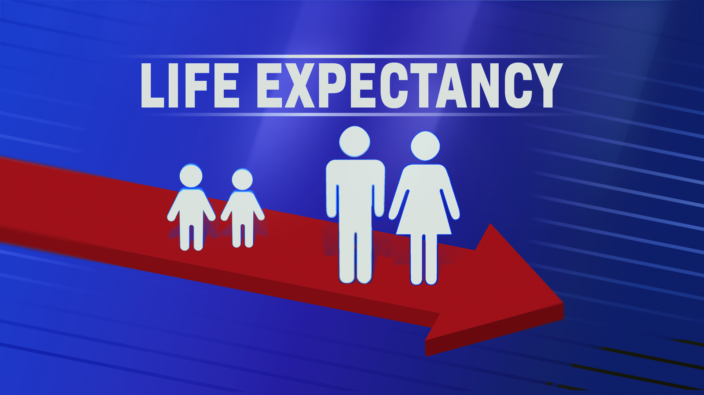

 

::: {style="font-size: 200%;"}
## Introduction
:::

 

Shruti Chauhan,\
University of Galway, Ireland\
`s.chauhan4@universityofgalway.ie`

**Hobbies**

-   Love Sports

-   Sleeping

-   Grocery Shopping

**What is my data about?**

 

{fig-align="center" width="473"}

{fig-align="center" width="478"}

Mental health plays a critical role in our overall well-being, and its impact extends far beyond our emotional state. This exploration delves into the complex relationship between three seemingly disparate factors: suicide rate, life expectancy, and depression.

By analyzing suicide rates alongside life expectancy and the prevalence of depression, we can gain valuable insights. We can explore whether areas with higher life expectancy also experience lower suicide rates, and how depression might act as a potential bridge between these two factors. Several studies consistently show that successful treatment of depression not only relieves depressive symptoms, but also decreases and makes suicidality vanish. [@rihmer2001can]

## Data Handling

### Loading

Necessary Library for data loading is used. i.e. Dplyr.

```{r}
knitr::opts_chunk$set(warning = FALSE, message = FALSE)
echo = FALSE
```

```{r}
#Loading library
library(dplyr)

#CSV Files are loaded. 
setwd("dataset/")
data1 <- read.csv("Depression.csv")
data2 <- read.csv("Life expectancy.csv")
data3 <- read.csv("Suicide Rate.csv")
```

### Cleaning

Datasets are inspected for any missing values, and if any are found, they need to be replaced.

```{r}
# Calculate the number of missing values
missing_values <- sum(is.na(data1))

# Print the number of missing values
print(paste("Number of missing values in the dataset:", missing_values))

```

```{r}
# Calculate the number of missing values
missing_values <- sum(is.na(data2))

# Print the number of missing values
print(paste("Number of missing values in the dataset:", missing_values))
```

```{r}
# Calculate the number of missing values
missing_values <- sum(is.na(data3))

# Print the number of missing values
print(paste("Number of missing values in the dataset:", missing_values))
```

### Merging

Datasets are merged on a common column and dataypes of the merged csv are displayed.

```{r}
# Merge the datasets on the common column
merged_data <- inner_join(data2, data3, by = "Country")

# Write the merged dataset to a new CSV file
write.csv(merged_data, "dataset/merged_data.csv", row.names = FALSE)

head(merged_data)
str(merged_data)

merged_data$GDP.per.capita <- as.numeric(gsub(",", "", merged_data$GDP.per.capita))

```

::: {.callout-important collapse="true"}
## Note

Depression CSV file is a textual data from a survey. Hence, not merged with the other two files.
:::

## Data Analysis

Quantitative and Qualitative analysis is performed on the datasets.

### Data Stream

As implied by its name, our presentation illustrates the progression of our datasets, depicting their interrelationships and informing about our ultimate analysis.

```{mermaid}
 flowchart LR
      A[Dataset 1] --> B["Men's Life Expectancy"]
    A -->  C["Women's Life Expectancy"]
    A --> D["Happiness Score"]
    A --> E["Fertility Rate"]
    A --> F[Country]
    
    G[Dataset 2] --> H["Suicide Rate"]
    G --> J["GDP per capita"]
    G --> L[Country]
    
    F --> L
    L -->|Data Merge|M[Modified Dataset]
    
    N[Dataset 3] --> O[Title]
    N--> P[Content]
    N --> Q[Score]
    M --> R[Suicide Prediction]
    P --> R
```

### Quantitative Analysis 1

A regression model is constructed to predict the suicide rate through inference.

```{r}
library(ggplot2)
library(plotly)

# Perform linear regression
model <- lm(Suicide.rate ~ Life.Expectancy..years....Men + Life.Expectancy..years....Women +
              Fertility.Rate..births.per.woman. , data = merged_data)

# Summary of the regression model
summary(model)

# Create ggplot object
p <- ggplot(merged_data, aes(x = GDP.per.capita, y = Suicide.rate)) +
  geom_point() +
  geom_smooth(method = "lm", se = FALSE, color = "blue") +
  labs(title = "Linear Regression: Suicide Rate Prediction",
       x = "GDP per capita",
       y = "Suicide Rate") +
  theme_minimal()

# Convert ggplot object to Plotly
p_plotly <- ggplotly(p)

# Display the interactive plot
p_plotly
```

-   The summary of the linear regression model shows that Life Expectancy for men and women, along with Fertility Rate per woman, significantly influence Suicide rate. For every additional year of Life Expectancy for men, Suicide rate decreases by about 1.88 units, whereas for women, it increases by approximately 1.57 units.

-   Conversely, each additional birth per woman is associated with a decrease of roughly 2.83 units in Suicide rate. The model explains around 30.59% of the variability in Suicide rate, indicating moderate explanatory power. With a highly significant F-statistic (p \< 0.001), the model effectively explains the variability in Suicide rate.

-   Overall, these findings underscore the importance of considering Life Expectancy and Fertility Rate in understanding Suicide rates and informing potential interventions.

### Quantitative Analysis 2

```{r}
library(plotly)
library(dplyr)

# Scatter plot to examine the relationship between fertility rate and life expectancy
fertility_life_exp_scatter <- plot_ly(merged_data, x = ~Fertility.Rate..births.per.woman., y = ~Life.Expectancy..years....Women,
                                      mode = "markers", type = "scatter", color = ~Country,
                                      text = ~paste("Country: ", Country, "<br>Fertility Rate: ", Fertility.Rate..births.per.woman.,
                                                    "<br>Life Expectancy (Female): ", Life.Expectancy..years....Women)) %>%
  layout(title = "Fertility Rate vs. Life Expectancy (Female)",
         xaxis = list(title = "Fertility Rate"),
         yaxis = list(title = "Life Expectancy (Female)"))


# Display the plots
fertility_life_exp_scatter

```

-   High fertility rates may lead to rapid population growth, while low fertility rates may result in population decline or aging populations.

-   Countries with higher fertility rates may have different cultural norms, access to family planning resources, and attitudes toward childbearing.

### Quantitative Analysis 3

A stacked barplot for happiness score vs fertility rate displays each country as a bar divided into segments. Each segment represents either the happiness score or fertility rate, stacked to show their combined values.

```{r}
# Load necessary libraries
library(ggplot2)
library(dplyr)
library(tidyr)

# Read the dataset
data <- read.csv("/Users/nareshkumar/MS5130-3/MS5130/dataset/merged_data.csv")

# Reshape data from wide to long format
data_long <- tidyr::pivot_longer(data, 
                                 cols = c(Fertility.Rate..births.per.woman., Happiness.Score),
                                 names_to = "Variable", 
                                 values_to = "Value")

# Calculate the mean fertility rate and happiness score for each country
data_summary <- data_long %>%
  group_by(Country) %>%
  summarize(Mean_Value = mean(Value)) %>%
  arrange(desc(Mean_Value)) %>%
  top_n(10)

# Filter the data_long to include only the top 10 countries
data_long_top10 <- data_long %>%
  filter(Country %in% data_summary$Country)

# Create stacked barplot
ggplot(data_long_top10, aes(x = Country, y = Value, fill = Variable)) +
  geom_bar(stat = "identity", position = "stack") +
  labs(title = "Top 10 Countries: Fertility Rate and Happiness Score",
       x = "Country",
       y = "Value") +
  scale_fill_manual(values = c("Fertility.Rate..births.per.woman." = "red", "Happiness.Score" = "blue")) +
  theme(axis.text.x = element_text(angle = 90, hjust = 1))

```


### Qualitative Analysis

Qualitative analysis involves examining textual data, such as survey responses, to uncover themes and sentiments related to depression. Text mining techniques extract insights from the data, while word cloud visualizations highlight common words or themes. This helps understand the experiences and perspectives of individuals dealing with depression in the dataset.

```{r}
#STEP 1: Retrieving the data and uploading the packages

library(wordcloud)
library(RColorBrewer)
library(tm)
library(dplyr)

# Additional stopwords
additional_stopwords <- c("just", "like", "know", "anymore", "want", "feel", "m", "life", "feeling", "get", "can", "think")

df <-read.csv("/Users/nareshkumar/MS5130-3/MS5130/dataset/Depression.csv", header = TRUE, sep = ",", stringsAsFactors = FALSE)
df <- head(df, n = 1000)

text <- df$title
docs <- Corpus(VectorSource(text))

#STEP 2: Clean the text data

docs <- docs %>%
  tm_map(removeNumbers) %>%
  tm_map(content_transformer(tolower)) %>%
  tm_map(stripWhitespace)
docs <- tm_map(docs, removeWords, c(stopwords("english"), additional_stopwords))


#STEP 3: Create a document-term-matrix

dtm <- TermDocumentMatrix(docs) 
matrix <- as.matrix(dtm) 

words <- sort(rowSums(matrix), decreasing = TRUE) 
df <- data.frame(word = names(words), freq = words)

#STEP 4: Generate the word cloud
set.seed(1234) # for reproducibility 
wordcloud(words = df$word, freq = df$freq, min.freq = 1, max.words = 200, random.order = FALSE, rot.per = 0.35, colors = brewer.pal(8, "Dark2"), wordLengths = c(0, Inf))


```

-   The word cloud focuses specifically on the dataset related to depression, indicating a targeted analysis of text data associated with this mental health condition

-   Depression stands as a prevalent mental health condition intricately linked with suicidal behavior. Those grappling with depression face an elevated susceptibility to experiencing thoughts of suicide, engaging in attempts, or completing the act. Consequently, delving into content related to depression offers valuable insights into the underlying factors influencing suicidal ideation. Such analysis serves as a crucial foundation for crafting tailored interventions aimed at thwarting suicide risks and fostering mental health and overall well-being.
